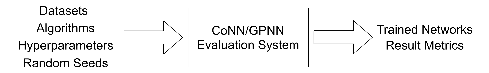
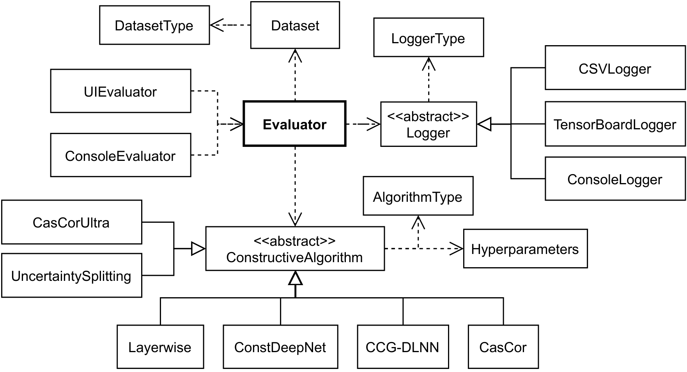

# CoNN Evaluation System

Owner: *Theodor Hartleitner (s2110455007@fhooe.at)*

This repository contains the source code related to the evaluation system created in my Masterthesis (see *Masterthesis.pdf* in the root of this repository). 

## Information
### Overview 

The Input/Output diagram of the evaluation system shows the capabilites of the evaluator and what parameters need to be specified for an evaluation to be possible.

### Class Diagram

The class diagram in figure 5.2 illustrates the most important elements of the software architecture and shows their dependencies. Dashed lines indicate dependencies while the normal lines show inheritance relationships. The central component is the Evaluator class which is responsible for orchestrating the entire evaluation process. It obtains the required inputs, evaluates the algorithms with the specified hyperparameters on the given datasets, and organizes the logging of the results. The classes handling user input are the UIEvaluator as well as the ConsoleEvaluator. They collect and preprocess the input parameters and forward them to the Evaluator. The abstract ConstructiveAlgorithm class encapsulates the functionality that a CoNN algorithm should possess, whereas most specific implementations are located in the child classes. The abstract Logger component handles the recording and calculation of result metrics. Multiple variants such as the CSVLogger or the TensorBoardLogger are available as output modalities. The Dataset component contains the currently used data for evaluation and performs data shuffling, data splits, and data visualization tasks. Multiple enumerations such as DatasetType, LoggerType, and AlgorithmType are employed to specify and configure the subclasses for the abstract components.

## Setup and Execution
0. make sure to have Python and pip3 installed on your machine
1. Navigate to the CoNN_Evaluation folder
2. Install required libraries: "pip3 install -r requirements.txt --upgrade"
3. The two variants of the evaluation system can now be run:
	1. running the file "./evaluation/evaluators/gui/start_gui_evaluator.py" will start the GUI application of the evaluation system
	2. running the file "./evaluation/evaluators/console/start_console_evaluator.py ./evaluation/evaluators/console/evaluation_config.json" will run the console application using the configuration specified in the *evaluation_config.json* file
